# Demo Application

## Introduction

This Demo app provides a comprehensive set of features. Alongside showcasing video and integrating technologies like ViewModel, Navigation components, Coroutine. The app includes robust user authentication features, such as login, registration, and password recovery. Users can securely upload encrypted videos, decrypt them for viewing, and share encrypted videos with others, ensuring privacy and enhanced functionality. These capabilities demonstrate how modern technologies collaborate to deliver a secure, efficient, and enjoyable user experience.

## Demo

[Demo](https://www.youtube.com/watch?v=ZK4zuUoke-E)

### Database

  

### How it works

The application includes features that allow users to register and log in using basic information, with options to update user details and change passwords. Additionally, it offers a video upload feature where videos are encrypted and stored in an encrypted folder. Users can only view videos after they have been decrypted and saved in the decrypted folder. Moreover, the shared video feature allows users to share encrypted videos, which are saved to Google Drive. Recipients can download these videos, and to view them, they must decrypt and store them in the shared video folder.

## Features

- SignIn screen
- SignUp screen
- Profile screen
- ListVideo screen
- Encrpyting video when upload
- Decrypt video when play
- Play Video
- More option BottomSheet (Play Video,Rename Video,Delete Video,Share Videos)
- Share encryted video

## Screenshots

<h3>SignIn Screen</h3>
  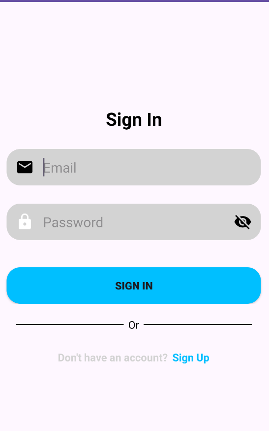

<h3>SignUp Screen</h3>
  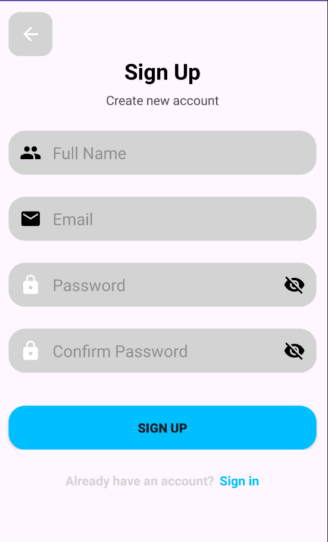

<h3>Upload Video Screen</h3>
  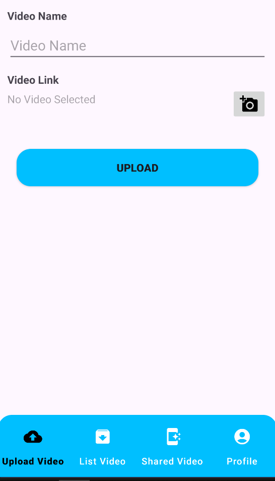

<h3>List Video Screen</h3>
  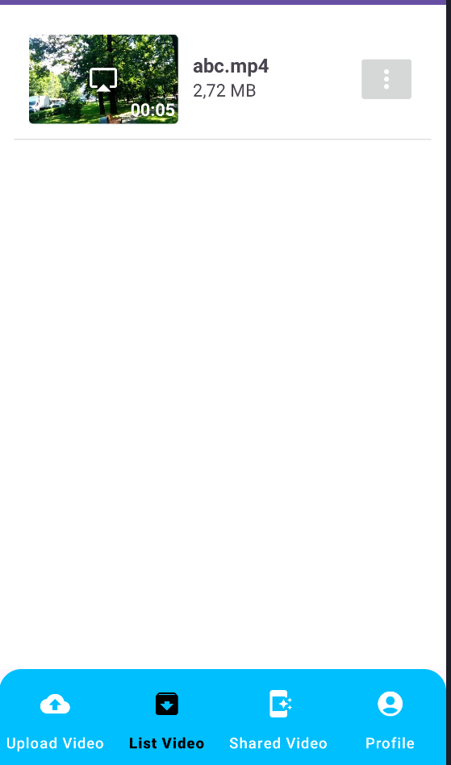

<h3>Shared Video Screen</h3>
  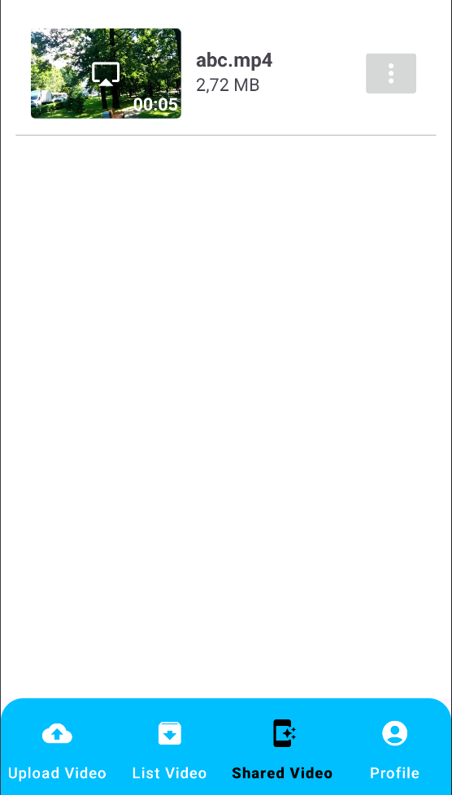

<h3>More Option Screen</h3>
  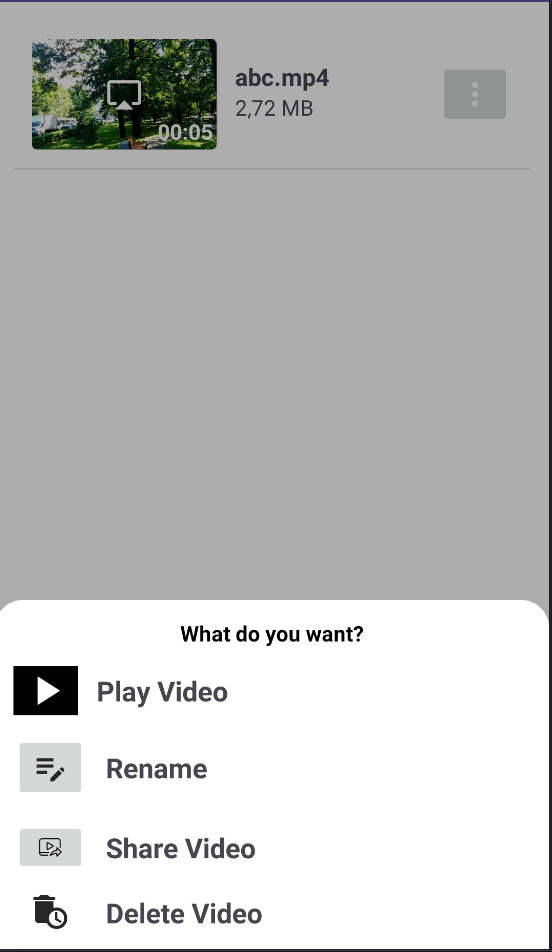

<h3>Play Video Screen</h3>
  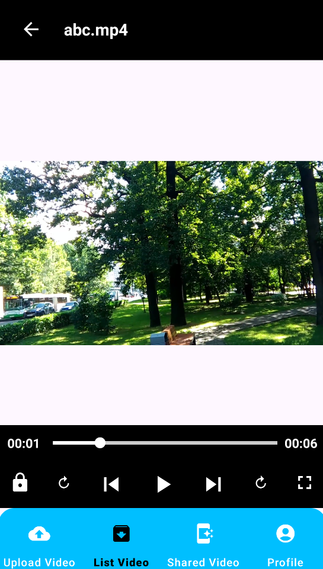

<h3>Profile Screen</h3>
  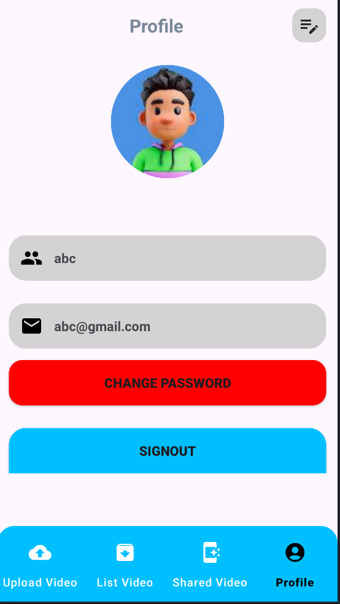

<h3>Edit Profile Screen</h3>
  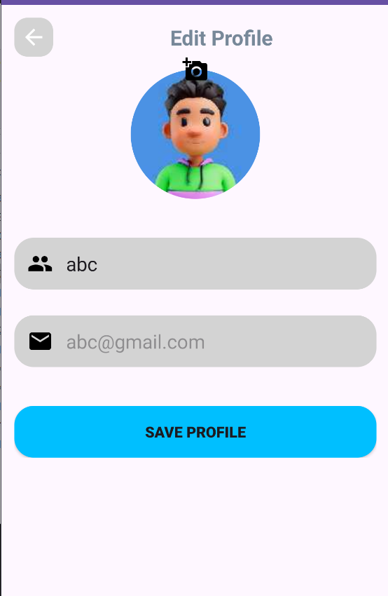

<h3>Edit Profile Screen</h3>
  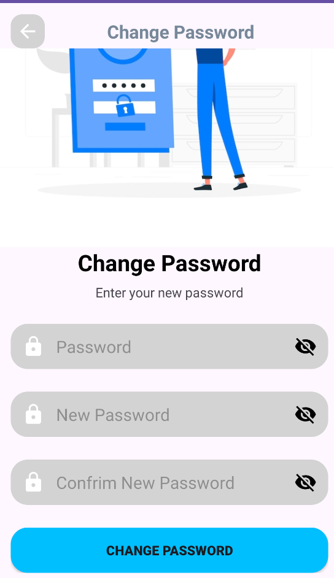

<h3>Folder</h3>
  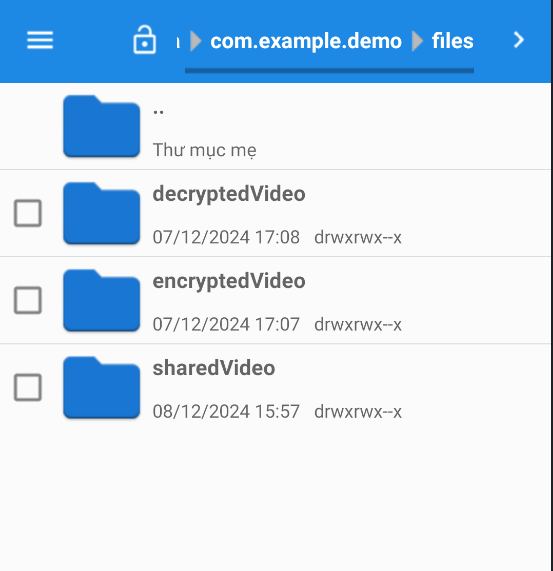

## Tech Stack

**Programming Language:** Kotlin

**Database:** Room

## Reference

| Tool                 | Link                                                                                            |
| -------------------- | ----------------------------------------------------------------------------------------------- |
| Navigation Component | [Navigation Component](https://developer.android.com/guide/navigation)                          |
| View Model           | [View Model](https://developer.android.com/topic/libraries/architecture/viewmodel)              |
| Room Database        | [Room Database](https://developer.android.com/training/data-storage/room)                       |
| Glide                | [Glide](https://github.com/bumptech/glide)                                                      |
| Circle Indicator     | [Circile Indicator](https://github.com/ongakuer/CircleIndicator)                                |
| Retrofit             | [Retrofit](https://square.github.io/retrofit/)                                                  |
| Bcrpyt               | [Bcrypt](https://mvnrepository.com/artifact/com.ToxicBakery.library.bcrypt/bcrypt/1.0.9)        |
| Security-Crypto      | [Security-Crypto ](https://developer.android.com/jetpack/androidx/releases/security)            |
| Exo Player           | [Exo Player ](https://mvnrepository.com/artifact/com.google.android.exoplayer/exoplayer/2.14.1) |
| MultiDex             | [MultiDex](https://developer.android.com/build/multidex?hl=vi)                                  |

## Requirements

- SDK 34
- Retrofit
